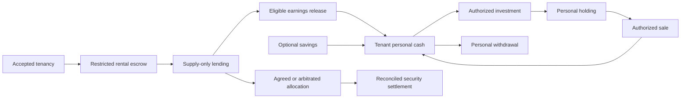

# Deposit workspace

**Build assets while renting.** A tenant's eligible deposit earnings can become contributions to a separate personal portfolio. Landlords retain a bounded rental-security workflow; assigned human arbitrators can resolve disputed claims. The product name is still undecided.

This public hackathon implementation explores **Robinhood Chain and Solana in parallel**. It includes a persistent walkthrough, verified-account and private-agreement services, restricted native escrows, and signing/reconciliation APIs. Local native proofs passed on both stacks. **A complete live investment flow and production deployment are not yet proved.** See [implementation status](docs/IMPLEMENTATION_STATUS.md) for the exact boundaries.

## Run locally

Use Node.js 24 LTS (minimum 22.18).

```sh
npm ci --ignore-scripts
npm run setup
npm run dev
```

Open [the workspace](http://localhost:4175). Use this hostname for passkeys; WebAuthn cannot use an IP address as its relying-party ID. Setup creates a private `.env.local` without printing secrets. The walkthrough works without accounts, wallets or funds and persists in local SQLite across reloads. All walkthrough people, homes, balances and transactions are fictional; the role selector belongs only to this demonstration.

1. Choose Robinhood or Solana. Accept the agreement as tenant and landlord.
2. As tenant, review and authorize the 3,000-unit deposit, then check its result and supply it to lending.
3. Add the explicitly labeled 10-unit sample return, release it, and review a personal investment. Optional savings go to personal cash separately.
4. Review accumulated investment exposure. It creates no second cash dividend.
5. As landlord, propose a 120-unit claim. The tenant can agree or dispute it; only the assigned arbitrator can decide a disputed allocation.
6. Authorize and reconcile settlement. A 120-unit allocation returns 2,880 of the original security to the tenant. Personal holdings remain theirs and can subsequently be sold and withdrawn in the walkthrough.
7. Open **Connections** for native proof details, real read-only Jupiter prices and provider setup status.

Every financial action has a review, an explicit authorization and a separate result check. A failed purchase leaves personal cash intact. A claim decision alone does not pay anyone.

## Architecture



| Layer          | Implemented choice                                                                                   |
| -------------- | ---------------------------------------------------------------------------------------------------- |
| Shared product | Next.js 16 / React 19, exact native token units, separate security and portfolio records             |
| Persistence    | SQLite locally; PostgreSQL for hosted operation; durable intent and receipt records                  |
| Identity       | Privy passkeys, backup access, user-owned EVM/Solana wallets and server-verified recovery challenges |
| Robinhood      | USDG, immutable Solidity escrow, Morpho adapter, bounded EIP-712 gas sponsor                         |
| Solana         | Test-only Anchor escrow, USDC, validated Kamino CPI, separate message-bound fee sponsor              |
| Investments    | Gated 0x/Jupiter adapters; keyless Jupiter price inspection; live buys/sales remain a proof gate     |

Account credentials being present is not a successful onboarding test. Native APIs authenticate actual provider identities and fixed tenancy roles; they never inherit the walkthrough's role selector or balances. The sponsor pays fees and receives no general investment authority.

Read the [build spec](docs/HACKATHON_BUILD_SPEC.md), [ADRs](docs/adr/README.md), [wallet setup](docs/WALLET_SETUP.md), [Robinhood operator guide](docs/ROBINHOOD_NATIVE_API.md), and [Solana operator guide](docs/SOLANA_NATIVE_API.md).

## Validate

```sh
npm test
npm run lint
npm run build
# Against the running local server; uses fresh fictional sessions:
npm run acceptance
# One authenticated reconciliation pass; schedule separately for hosted operation:
npm run reconcile
```

[Validation evidence](docs/VALIDATION.md) distinguishes application tests, actual local protocol execution, public price observations and unperformed live acceptance. Native contract/program commands are in [the EVM guide](contracts/evm/README.md) and [the Solana guide](programs/rental_escrow/README.md).

## Project map

- `src/domain/` — exact amounts, demonstration accounting and savings illustrations.
- `src/server/` — authenticated tenancy/evidence services, persistence, recovery and native operation orchestration.
- `src/wallets/` — account onboarding and user-controlled signatures.
- `src/finance/` — independent native observations, transaction plans and receipt validation.
- `contracts/evm/` and `programs/rental_escrow/` — restricted custody implementations and native tests.
- `src/components/` and `app/` — role journeys, connection controls and same-origin APIs.
- `docs/` — build scope, decisions, evidence and operator handoff.

## Provenance and scope

This work grows out of the earlier **Smart Rental Deposit** Gnosis prototype. Pre-existing product research and tenancy rules informed this implementation. The new public interface started on September 21, 2026; the parallel native implementation and selected architecture records were added on September 22. The prior private checkout reference was `07573bd3fa66f1af6c99b2d264af39ee767154a3`, with additional uncommitted work. This is a review reference, not a complete competition baseline. The submission must disclose prior work and distinguish competition-period changes. See the [official hackathon rules](https://colosseum.com/legal/Crypto%20World%27s%20Fair%20Hackathon%20Rules.pdf).

This repository does not contain the private backend, tenant data, environment files, keys or old Git history. No hackathon submission, financial-provider approval, bank transfer or real-money deployment has been performed. RealT, insurance pooling, borrowing, guaranteed returns and automatic recurring investment are outside this version. Public visibility is not a project-wide license decision; that remains to be chosen.
