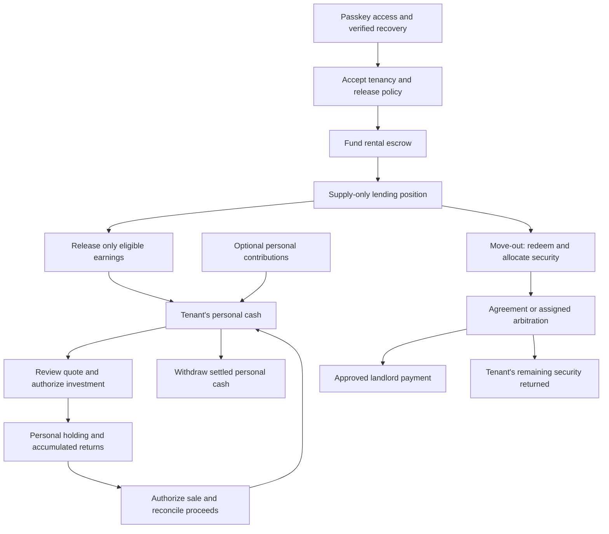

# Rental asset-building hackathon build spec

Updated: 22 September 2026. Status: accepted implementation scope; completion evidence is tracked separately. Brand and production market remain undecided.

**Build assets while renting:** eligible deposit earnings become contributions to the tenant's separate personal portfolio. The same application also gives landlords understandable security and claims, and arbitrators a bounded evidence-and-decision workflow.

This is the entry point for what the hackathon app should build. The [glossary](../CONTEXT.md) defines the domain, the [ADRs](adr/README.md) record durable decisions, and the [parallel exploration](PARALLEL_STACK_EXPLORATION_2026-09-22.md) plus its stack reports retain technical evidence. Earlier Base recommendations are fallbacks. This scope does not replace the existing Gnosis product or its launch proof.

## Scope and current baseline

The build target is the existing public `rental-deposit-hackathon` project. Selected architecture documents are now maintained in this public implementation. Read [implementation status](IMPLEMENTATION_STATUS.md) for completed code and remaining proof gates. Public implementation should reuse reviewed workflows and business rules without copying private operational material or secrets.

The original public baseline was an interactive simulation. The new implementation adds persistent demonstration records, verified account and agreement services, and independent native finance proofs. Its `src/domain/rental.ts` uses integer cents, a role selector and a fictional $800 claim-settlement example; `portfolioHeld` means a landlord's aggregate rental security, not the tenant's investment portfolio. It is not connected custody, authorization or investing. The new acceptance scenario below deliberately replaces that example; the existing simulator is useful design evidence, not finance proof.

The existing private code also needs adaptation: tenancy access uses Safe fields and lowercases wallet strings, while Solana public keys must retain their case. Funding and custody encode Gnosis/Aave assumptions. Reuse requires explicit network-aware identity, authorization and accounting work.

First-demo scope is one funded tenancy per scenario, one supply-only lending position, one eligible investment instrument, explicit approval of each trade, one ordinary settlement and one disputed settlement. Optional personal contributions can use the same personal cash account. The first investment proof excludes US users because the proposed xStock route is unavailable to them. A wallet address, IP address or user assertion alone does not establish issuer eligibility; an executable route needs a current, verified eligible profile. The eventual production market remains undecided. RealT, guaranteed property ownership, insurance pooling, borrowing, automatic recurring trades, cross-chain custody and utility-meter ingestion are outside this version. Bank funding and withdrawals require a separate verified provider route; the initial exit is to a permitted personal stablecoin destination.

## Role journeys and screens

| Role       | Screens and decisions                                                                                                                                  | Acceptance                                                                                                                                                                                           |
| ---------- | ------------------------------------------------------------------------------------------------------------------------------------------------------ | ---------------------------------------------------------------------------------------------------------------------------------------------------------------------------------------------------- |
| Tenant     | Passkey onboarding and recovery; tenancy agreement; deposit funding and earnings; personal cash and holdings; quote review; claim response; withdrawal | Can explain what remains secured, what is releasable, what is personal cash and what is invested. Every spend has a concrete amount, destination and confirmation. Personal holdings survive a move. |
| Landlord   | Tenancy creation/invitation; funding status; shared documents; claim and settlement proposal                                                           | Sees verified security and unresolved obligations; can propose a bounded deduction with evidence. Cannot direct personal investing or spend tenant portfolio assets.                                 |
| Arbitrator | Assigned dispute inbox; parties' evidence; reasoned allocation; settlement status                                                                      | Can decide only assigned disputed claims within their bounds. A decision appears separately from actual payment; no portfolio or general operator authority.                                         |

The tenant home should lead with personal asset progress and the next useful action, with rental security clearly distinct. Landlord views prioritize funded security and pending actions; arbitrator views prioritize assigned cases. Use one primary action per task and readable mobile layouts. Explain money, consent and pending status in normal language; place chain evidence and technical identifiers in an expandable details area.

Passkey access, verified recovery to the same wallet and fees sponsored for the full declared flow are required on both tracks. A browser wallet remains a technical testing option, not completion of the consumer journey. Recovery and financial consent are separate checks. The visual role switch may remain in a labeled simulation, but actual access comes from verified identity and tenancy/case membership.

## Money flow and invariants

- A tenancy fixes the network, asset, parties, security requirement and release policy before funding. Changing a UI chain selection cannot alter them.
- Account separately for principal, retained earnings, released earnings, personal contributions, personal cash, holdings, costs and losses. Value lending receipts using the selected protocol's conversion and liquidity rules.
- Active-tenancy releases cannot exceed policy-permitted earnings, uncommitted surplus above required security, or what can actually be redeemed. Prior releases and pending commitments are included once. A shortfall or stale valuation blocks release; it must not be disguised as zero earnings.
- An accepted claim or arbitrator decision does not move money. Settlement completes only after the authorized payments reconcile. Its amount cannot exceed the claim and remaining available security.
- Landlord and arbitrator permissions never cover personal cash or holdings. An unsuccessful investment leaves released cash identifiable; retrying it must not release the same earnings twice.
- For the current accumulating-instrument candidates, changes in exposure do not create a second cash dividend. A sale must settle before proceeds become withdrawable cash.
- Network fees, account creation, trading fees and price movement are visible costs with an identified payer. The original security must not silently pay application operating costs.

## Modules, records and state

Keep protocol complexity behind the shared finance interface, following [ADR 0002](adr/0002-one-product-independent-chain-adapters.md). An interface includes its authorization requirements, failure behavior and evidence, not just method names.

| Module              | Owns                                                                                       | Interface responsibility                                                                                                                |
| ------------------- | ------------------------------------------------------------------------------------------ | --------------------------------------------------------------------------------------------------------------------------------------- |
| Identity and access | Users, verified wallet links, recovery setup and role membership                           | Authenticate a person and establish their authority for a specific tenancy or personal portfolio.                                       |
| Tenancy and claims  | Agreement, required security, release policy, parties, claims and allocations              | Create/accept a tenancy; propose/respond to claims; record valid decisions and settlement prerequisites.                                |
| Private evidence    | Documents, condition records, dispute reasons and access history                           | Expose only material the requesting party is entitled to see; keep identities and documents off public ledgers.                         |
| Deposit finance     | Custody identity, underlying assets, lending receipts, earnings and release limits         | Observe deposit state and plan permitted funding, lending, release and settlement actions.                                              |
| Personal investing  | Eligible instrument, personal cash, quotes, orders, holdings and corporate actions         | Plan tenant-approved purchases, sales and cash withdrawals independently of tenancy custody.                                            |
| Finance operations  | Authorized intent, native transaction steps, provider receipts and reconciliation progress | Plan, submit and reconcile through the selected chain adapter; resume after interruption without repeating completed financial effects. |

Records use an explicit network and asset identifier and integer atomic units. Lending receipt units, underlying amounts and investment exposure have separate meanings. Solana keys are case-sensitive; EVM address normalization must not be applied universally. Missing observations are unknown, with an error/freshness marker, rather than a zero balance.

Keep these state models separate:

| Record              | Required progression and completion rule                                                                                                                                                                                                      |
| ------------------- | --------------------------------------------------------------------------------------------------------------------------------------------------------------------------------------------------------------------------------------------- |
| Tenancy             | Draft → accepted → funding → active → closing → settling → closed. Activation requires verified funding; closure requires completed settlement, not just a decision.                                                                          |
| Claim               | Proposed → accepted, contested or withdrawn; a contested claim may receive an assigned arbitrator's decision. A pending/disputed claim constrains deposit operations, not the personal portfolio.                                             |
| Financial operation | Planned → awaiting authorization → submitted → confirming → completed, with explicit failed/expired/cancelled outcomes where known. A timeout after submission remains unresolved until reconciled; it is not permission to resubmit blindly. |

Each financial operation retains its intent, tenancy or personal-portfolio association, asset amounts, allowed recipients, fee/slippage bounds, quote expiry, authorization digest, idempotency identity and individual step receipts. Store chain/provider observations and correction history so restarts, duplicate notifications and reorg/expiry handling do not fabricate or duplicate balances. The durable reconciler must outlive an individual Next HTTP request. The implemented database-backed worker and native sponsorship choices are recorded in ADR 0008. [ADR 0007](adr/0007-reconcile-financial-operations-in-durable-steps.md) records this operation architecture and its trade-offs.

## Acceptance scenario

Run the same fictional scenario independently on Robinhood and Solana, using USDG and USDC respectively. These are distinct assets; “3,000 units” is a comparison input, not a claim of equal issuer risk or a legal conclusion. The declared test agreement permits release of eligible earnings.

1. **Onboard and agree.** Tenant and landlord use verified identities. The tenant registers backup access and recovers the same wallet on a second device. Store the agreed parties, amount, denomination and release policy.
2. **Fund and supply.** Fund 3,000 units into the authorized escrow and supply to the selected position without borrowing. Verify custody, receipt ownership and actual asset deltas. The user needs no native gas token, including when accounts are newly created.
3. **Release earnings.** A labeled local fixture creates 10 units of eligible earnings. Release those 10 to personal cash while preserving the 3,000 security requirement. Reject release when policy forbids it, when an obligation is underfunded or when redemption cannot complete.
4. **Buy and reconcile.** Obtain an authorized 10-unit investment order and confirm its resulting position. Separately measure 5/10/25-unit trade economics with full costs. An expired or failed purchase preserves available personal cash and does not repeat the release.
5. **Hold, sell and withdraw.** Exercise a declared accumulating-return fixture and show correct exposure without invented cash. Demonstrate a sale and then personal cash withdrawal; reconcile each completed step and show restrictions or delays.
6. **Settle both outcomes.** In one run the tenant accepts a 120-unit landlord claim. In a separate run an assigned arbitrator resolves a contested claim within the requested amount. A 120-unit allocation returns 2,880 units to the tenant in the no-loss/no-extra-fee fixture. Portfolio access survives closure.
7. **Recover failures.** Repeat duplicate submission, interrupted confirmation, unavailable sponsorship, wrong network/asset, substituted recipient, stale valuation, redemption failure and unauthorized-role cases. Show useful recovery paths rather than success messages without evidence.

Each proof records environment, deployment/source version, fixture changes, initial/final balances, operation IDs and receipts or provider results. Distinguish live reads, local execution, testnet actions, provider test fills and UI/event fixtures. The acceptance scenario defines the desired continuous journey; stitching separate environments together does not prove a continuous live money flow.

## Build slices and decision gates

These are bounded deliverables to implement, not completed features or remotely created tickets. Each slice crosses the domain, interface and its relevant UI; avoid spending the entire first phase on generic infrastructure.

| Slice                      | User-visible result                                                                   | Depends on                                                                          | Evidence to finish                                                                                                                                              |
| -------------------------- | ------------------------------------------------------------------------------------- | ----------------------------------------------------------------------------------- | --------------------------------------------------------------------------------------------------------------------------------------------------------------- |
| S1: identity and agreement | A tenant and landlord accept a persisted tenancy with passkey access and recovery     | Wallet model proof; shared identity and tenancy records                             | Second-device recovery, role isolation and a stable funded-wallet identity; no role-selector authorization.                                                     |
| S2-R / S2-S: deposit       | A funded deposit displays verified security and lending value                         | S1, reviewed custody proposal; chain-specific manifest                              | Robinhood escrow/Morpho proof or Solana escrow/Kamino CPI proof, including rejected authority and accounting cases. Run the two technical proofs independently. |
| S3: eligible earnings      | Tenant sees earned, releasable and released amounts and can release 10 eligible units | Corresponding S2                                                                    | Policy/shortfall/illiquidity failures and no repeated release; exact account deltas.                                                                            |
| S4: personal investments   | Tenant buys, sees accumulated exposure, sells and withdraws personal cash             | S3 and actual route access; standalone route proof can start earlier                | Quote/signing/fill/exit evidence with measured fees; receipt and multiplier accounting.                                                                         |
| S5: claims and settlement  | Parties resolve an ordinary or disputed claim and close the tenancy                   | Corresponding S2 and shared role/evidence workflow; can proceed independently of S4 | Capped allocations, reconciled payments and continued personal-wallet access.                                                                                   |
| S6: complete presentation  | Mobile and desktop journeys work with clear proof details                             | S1–S5 on the demonstrated track                                                     | Full acceptance replay, recovery after interruption, accessible confirmations and no unlabeled simulated financial result.                                      |

Technical proof is permitted while an ADR is proposed; funded integration should not silently lock in a proposal before its review and proof gate. Provider outages/access waits on one track need not stop independent work on the other. If an investment route is unavailable, report that portion as unproven and use an explicitly labeled fixture for the narrative.

The [staged tenancy journey](STAGED_SOLANA_ONBOARDING.md) replaces synchronized setup signatures on a **separate** devnet program while preserving the funded tenancy on its pinned program. Landlord-only creation, later tenant funding, Kamino supply/redemption, zero-claim acceptance and full tenant payout have finalized with independently verified account state. Earned yield and investment execution remain separate proof gates.

| Unresolved choice                         | Working default                                                                                                                                                 | How to resolve it                                                                                                                                                                                         |
| ----------------------------------------- | --------------------------------------------------------------------------------------------------------------------------------------------------------------- | --------------------------------------------------------------------------------------------------------------------------------------------------------------------------------------------------------- |
| Custody and upgrade authority             | Dedicated restricted escrows; isolated upgrade governance                                                                                                       | Review ADR 0003, enumerate every spending/upgrade path and pass the custody proof before funded demo integration.                                                                                         |
| Solana wallet authority                   | Privy user-owned embedded wallet + Kora sponsor                                                                                                                 | Review ADR 0004 and pass recovery, signature and full-flow sponsorship tests. Evaluate Swig if direct on-chain passkey authority is required.                                                             |
| Robinhood sponsored signing               | Supported Safe/passkey path                                                                                                                                     | Prove the actual bundler, P-256 and recovery combination; existing Pimlico configuration is not proof of support.                                                                                         |
| Exact lending and investment dependencies | Robinhood proposal in [ADR 0005](adr/0005-robinhood-usdg-morpho-and-stock-tokens.md); Solana proposal in [ADR 0006](adr/0006-solana-usdc-kamino-and-xstocks.md) | Resolve the stack proof gates and pin reserve/vault version, liquidity/gates, eligible customer profile, token and executable buy/sell route. Record available test environments in the detailed reports. |
| Minimum economical investment             | Measure 5/10/25-unit orders                                                                                                                                     | Agree the contribution threshold after quotes include fixed costs and spread; do not advertise inexpensive micro-investing before measurement.                                                            |
| Durable execution runtime                 | Same-origin Next application with persistent operation records                                                                                                  | Choose a managed worker/job runtime with authenticated retry and reconciliation before S4/S6; keep transaction authority out of that operator role.                                                       |
| Main demo chain                           | Robinhood and Solana remain parallel                                                                                                                            | Compare completed evidence, access, onboarding and costs at the connected-flow checkpoint. No assumption of two prize awards.                                                                             |
| Production market and business terms      | Undecided                                                                                                                                                       | Separate customer/provider validation, pricing and custody/release review from the hackathon test policy; no demo implies launch readiness.                                                               |

Brand, a fiat integration and a later property instrument do not block these technical proofs. This planning pass creates no new provider access or authorization to transact real money.
