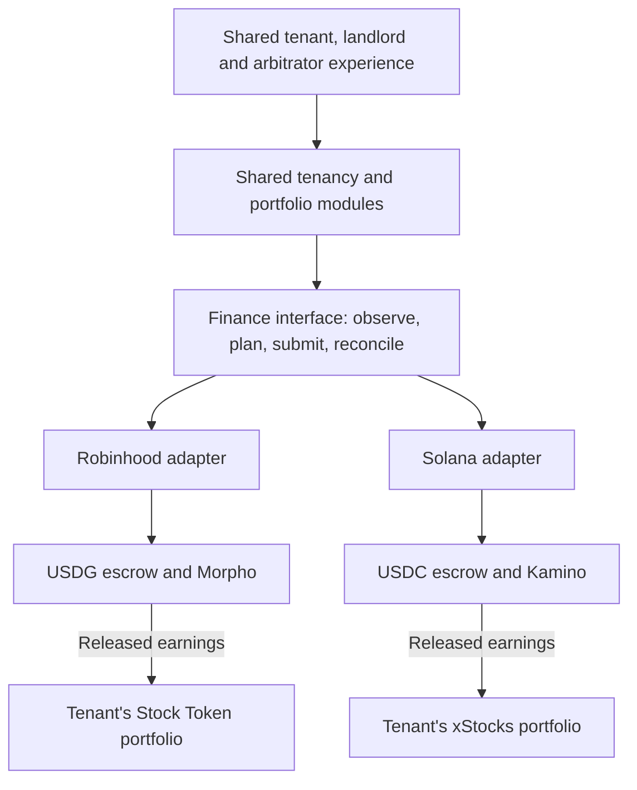

# Parallel exploration: Robinhood Chain and Solana

Date: 22 September 2026. Status: the user authorized parallel exploration of both stacks. This is the current coordination plan; no final production chain is selected. Brand remains undecided.

For the consolidated implementation scope, role journeys and acceptance slices, start with the [build spec](HACKATHON_BUILD_SPEC.md). The [ADRs](adr/README.md) distinguish established design directions from proposed custody and wallet choices; the [glossary](../CONTEXT.md) fixes the domain terminology.

Decision records for this plan: [0001 — security and personal portfolio](adr/0001-separate-rental-security-and-personal-portfolio.md), [0002 — shared product and adapters](adr/0002-one-product-independent-chain-adapters.md), [0003 — restricted custody](adr/0003-enforce-custody-in-restricted-escrows.md), and [0007 — durable financial steps](adr/0007-reconcile-financial-operations-in-durable-steps.md). See the [coverage map](adr/README.md#coverage-of-the-three-implementation-plans) for the two chain-specific proposals.

**One product, two independent finance implementations.** Robinhood explores reuse of the Solidity/EVM work. Solana gets a complete program, wallet, lending, investment, and operations plan. Both must demonstrate the same tenant outcome: eligible deposit earnings build a personal investment portfolio that survives a move.

Detailed track reports:

- [Robinhood Chain exploration](ROBINHOOD_STACK_EXPLORATION_2026-09-22.md)
- [Solana exploration](SOLANA_STACK_EXPLORATION_2026-09-22.md)
- Earlier product and investment plan, including the Base fallback and prior provider research

## 1. What runs in parallel

| Work                         | Robinhood Chain                                                                                                    | Solana                                                                                                                         |
| ---------------------------- | ------------------------------------------------------------------------------------------------------------------ | ------------------------------------------------------------------------------------------------------------------------------ |
| Deposit asset for comparison | USDG on Robinhood Chain                                                                                            | USDC on Solana                                                                                                                 |
| Rental custody               | Restricted per-tenancy Solidity escrow; reuse reviewed business rules and EVM tooling                              | New Rust/Anchor escrow program; per-tenancy program-derived authority and token accounts                                       |
| Supply-only yield            | Morpho vault adapter, with share conversion and vault-specific liquidity checks                                    | Kamino reserve adapter, with reserve/receipt accounting and CPI/account validation                                             |
| Personal investments         | Robinhood Stock Tokens, through an eligible supported venue                                                        | Eligible xStocks through a supported Solana venue                                                                              |
| Distributions                | Corporate-action multiplier; raw ERC-20 balance stays unchanged                                                    | Token-2022 scaled amounts for the selected xStock; raw amount and displayed exposure differ                                    |
| Wallet work                  | Verify Safe/passkey flow, recovery and supported fee sponsorship; existing Pimlico setup is not assumed compatible | Privy passkey access with a user-owned embedded wallet, separate fee payer/Kora, and same-wallet recovery; required demo scope |
| First external uncertainty   | Actual RWA execution access, small-order quotes and withdrawal path                                                | Actual eligible mint/route, lending reserve and usable test environment                                                        |

These are proposed implementations, not claims that either complete flow already works. Provider details and live-read evidence belong in the respective track report. USDG and USDC are distinct assets; comparing dollar-denominated scenarios does not establish equal issuer risk or interchangeable balances.

Both connected demos must support passkey access without a browser wallet extension, verified recovery to the same wallet, and the complete declared transaction flow with no user-held native gas token. Sponsorship includes required account creation, not just the base transaction fee. External wallets remain useful for isolated technical tests. On Solana, Squads is a candidate for shared operator/upgrade governance; the restricted rental escrow enforces tenancy rules independently. See [Solana wallet scope and acceptance criteria](SOLANA_STACK_EXPLORATION_2026-09-22.md#5-wallets-banking-and-server-operation).

Each tenancy is bound to a chain and deposit asset when it is created. A tenant can have separate tenancies or personal holdings on either chain. Changing a screen's chain selection must not migrate custody, reinterpret an address, or move funds. No bridge is needed inside either initial deposit-to-investment flow.

## 2. Reuse deliberately

The existing private repository contains working tenancy/document workflows and Gnosis finance fork evidence. It also contains chain-specific funding and custody assumptions. The public `rental-deposit-hackathon` repository currently contains an interactive frontend and in-memory accounting simulation, with no live authentication, wallet, chain or backend integration. Porting selected modules is future work, not completed connectivity.

Useful shared material includes role journeys, listings, contract records, private evidence, tenancy transitions, claim amounts, notification copy and layout work. Review the old authorization logic before reuse. The public prototype's role switch is a demonstration control, not authorization.

Existing model details that cannot become the new interface unchanged:

- `Party.wallet_chain_id` and the tenancy's `Safe` relationship encode an EVM-centric wallet model. Network identity and custody references must also represent Solana clusters and program accounts. See schema.
- `WorkspaceTenancy` exposes `safe_id`, `safe_address`, and an integer `chain_id`; retain a legacy mapping rather than fabricating a Solana Safe. See tenancy model.
- The public simulation accounts in integer cents. Native token amounts, receipt shares and accumulated exposure need their full precision. Keep cents as a display/input convention, not the settlement unit.
- Aave aToken accounting does not implement Morpho share conversion or Kamino receipt valuation. Those implementations must be separate adapters.

When implementation starts, use the existing public project for the hackathon app. A proposed layout is `src/domain/` for shared rules, `src/finance/robinhood/` and `src/finance/solana/` for adapters, `contracts/evm/` for Solidity, and `programs/rental_escrow/` for Solana. Each adapter should have an isolated implementation branch/worktree; one owner integrates shared-interface and UI changes. No worktrees or new repositories were created for this research.

## 3. The shared finance interface

Place the seam at product intent, not at a generic RPC call. The frontend asks to fund a deposit, release eligible earnings, buy an approved asset, withdraw personal cash, or execute a recorded settlement. Each adapter owns protocol account discovery, native transaction construction, simulation, submission tracking, and reconciliation.

| Interface operation | Required behavior                                                                                                                                                        |
| ------------------- | ------------------------------------------------------------------------------------------------------------------------------------------------------------------------ |
| Observe             | Return custody, liability, earned/released amounts, personal holdings, restrictions, and freshness/evidence metadata. Unavailable data must be marked unknown, not zero. |
| Plan                | Validate an intent and return authorized recipients, native signing steps, fees, limits, quote expiry and any unmet prerequisite. A plan changes no money.               |
| Submit              | Accept the exact wallet-authorized plan and retain operation/transaction identifiers. No UI toggle or server API key grants spending authority.                          |
| Reconcile           | Advance each step using verified chain/provider evidence. Recover from interruptions without duplicate financial effects.                                                |

The interface also specifies these invariants:

- Network identity is discriminated: EVM chain ID or a Solana cluster verified by its genesis identity. A token reference includes its network plus contract/mint and token program where applicable. Asset metadata is verified rather than supplied by an arbitrary caller.
- Amounts cross JSON interfaces as integer strings in native atomic units; calculations use integer arithmetic. Token amounts, lending shares, fiat valuation, and corporate-action multipliers have distinct types and rounding rules.
- Deposit principal, retained earnings, released earnings, personal contributions, personal cash, and investment value are separate ledger concepts. Landlord/arbitrator authority never extends to the personal portfolio.
- Earned does not mean available for release. Release is bounded by the actual tenancy policy, remaining security requirement, already committed amounts and redeemable liquidity. Losses/stale valuations cannot be hidden by showing zero interest.
- A vault standard's `maxWithdraw`/`maxDeposit` view is not universally an executable liquidity quote. The adapter must document the protocol-specific checks and simulation that justify a proposed action.
- Native signatures and transaction formats remain explicit within wallet signing. An EVM signature is never reused as Solana authorization. Application login and financial consent are separate.
- Completion is independent of tenancy phase. Submitted transactions and announced distributions are not completed payments. The adapter handles EVM replacements/reorgs and Solana expiry/confirmation without the UI assuming equivalence.
- Multi-step flows can partially complete. A failed investment leaves released personal cash identifiable and recoverable; it must not trigger a second earnings withdrawal. There is no promise of atomic rollback across providers.
- Price/exposure accounting must not apply a corporate-action multiplier twice or credit accumulating distributions again as cash.

Both currently proposed investment paths accumulate distributions in holdings. The shared portfolio model can also represent cash distributions for a later provider, but the initial UI must display the selected instrument's actual behavior. Selling an investment to obtain cash is a different operation from withdrawing an existing cash balance.

## 4. One comparison scenario

Use this declared fictional test fixture on both stacks, with network-specific assets and receipts:

1. Tenant and landlord agree to a 3,000-unit dollar-denominated security deposit, eligible earnings release policy, fixed payout recipients, and bounded human arbitration.
2. Tenant funds the escrow; only verified funding activates the deposit. Supply to the selected lending position without borrowing.
3. An explicitly controlled fixture creates 10 units of earned, policy-releasable surplus. The 3,000-unit security requirement remains. This tests accounting; it is not a claim about current APR or how quickly real earnings appear.
4. Release the 10 units into the tenant's personal account. Obtain an investment quote and record costs before authorization. Separately test $5/$10/$25 trade economics; do not pool different tenants.
5. Reconcile the investment position. Exercise a declared corporate-action fixture and verify correct accumulated exposure; demonstrate a permitted sale and personal cash withdrawal.
6. At move-out, an agreed or bounded arbitrated 120-unit claim is paid to the landlord, with 2,880 returned to the tenant in the no-loss/no-extra-fee scenario. The separate portfolio remains accessible after tenancy closure.

Fees, market movement, tax withholding, lending losses and unavailable liquidity are separate test cases. Do not silently subtract operating costs from the original security or assume stablecoin redemption always equals its peg.

## 5. Evidence and next implementation steps

| Milestone             | Evidence required independently on each chain                                                                                                                                    |
| --------------------- | -------------------------------------------------------------------------------------------------------------------------------------------------------------------------------- |
| Module map            | Actual modules/programs, token identities, authority model, supported SDKs and provider access conditions                                                                        |
| Read-only probe       | Current chain/program/token identity, reserve or vault state, receipt conversion and one canonical investment asset                                                              |
| Local custody proof   | Fund/supply/harvest/settle; reject unauthorized recipients, over-harvest, replay and portfolio access by the landlord                                                            |
| Consumer wallet proof | Passkey enrollment, explicit financial consent, same-wallet recovery on another device, and sponsored transactions including account creation with no user-held native gas token |
| Provider proof        | Accessible quote route with full costs, eligible profile, expected signing, settled position and exit path                                                                       |
| Connected demo        | Every UI state reconciles with its backing operation; evidence labels distinguish mainnet reads, local forks, testnet actions and fixtures                                       |

A protocol deployed on devnet/testnet does not prove that the required reserves, oracles, liquidity and investment assets exist there. Public-chain reads do not prove transaction execution. Forked/local program execution can establish important technical behavior while leaving provider order access unproven. Each report must retain those distinctions.

The next implementation slices can run in parallel after this exploration: Robinhood restricted escrow plus Morpho accounting; Solana escrow/PDA plus the selected reserve's CPI integration. Shared authentication, tenant portfolio records and the interface belong to the common app work. External access waits on one track need not block independent progress on the other.

At the first connected-flow checkpoint, compare remaining work, access constraints, wallet steps, small-trade costs, recovery behavior and demo clarity. Continue both when useful; select the strongest demonstrated path for the main presentation near the deadline. Do not infer a winner from chain branding or prize-pool size.

Colosseum's current rules allow a team one project submission at a time. Parallel implementations can inform that project; dual ecosystem award eligibility has not been confirmed. [Official rules, section 7](https://colosseum.com/legal/Crypto%20World%27s%20Fair%20Hackathon%20Rules.pdf).

## 6. Scope and completion of this exploration

Read-only exploration results received from the two tracks:

| Track     | Concrete evidence                                                                                                                                                                                                    | What it does not prove                                                                                           |
| --------- | -------------------------------------------------------------------------------------------------------------------------------------------------------------------------------------------------------------------- | ---------------------------------------------------------------------------------------------------------------- |
| Robinhood | At block 69,695,660, canonical USDG and selected vault asset matched; USDG has 6 decimals and vault shares 18. Share conversion and Stock Token multiplier reads succeeded; Safe4337/EntryPoint bytecode is present. | Actual escrow deposits/withdrawals, a working passkey user operation, RWA access or an investment fill.          |
| Solana    | Mainnet KLend and the issuer-identified SPYx mint were readable. A public Jupiter request returned an indicative $10 USDC-to-SPYx quote. The corresponding SPYx mint was absent on devnet.                           | An executable/signed trade, a matching devnet lending-and-investment environment, or a complete CPI escrow flow. |

The detailed reports retain source blocks/slots, exact asset identifiers, response limitations and primary sources. Do not upgrade these evidence levels when presenting the demo.

This work produces two sourced stack plans, a shared interface and common acceptance criteria. No application migration, financial transaction, provider registration, outreach, deployment, CI change or public push is implied. The existing Gnosis production/fork evidence remains specific to that product and environment.

Keep the tenant's asset-building journey central. The landlord needs understandable security and settlement controls; the arbitrator needs assigned evidence and bounded decisions. Insurance pooling, cross-chain collateral, leverage and automated security selection are outside these first proofs.
