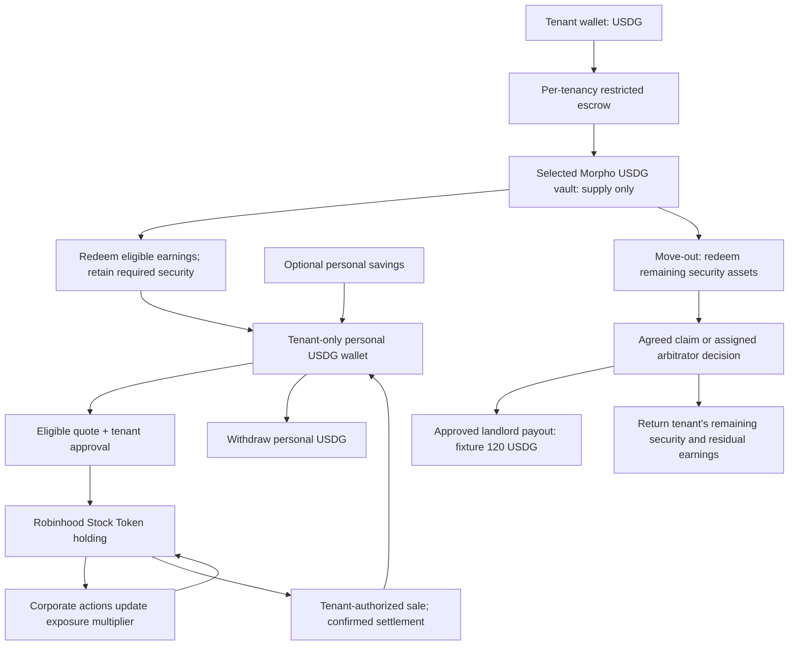

# Robinhood Chain exploration: rental deposit to personal investments

Date: 22 September 2026. Status: parallel research track, alongside Solana. No application code, wallet, provider account, deployment, or financial transaction was created in this exploration. Brand remains undecided.

The stack proposal is recorded in [ADR 0005](adr/0005-robinhood-usdg-morpho-and-stock-tokens.md), with [ADR 0003](adr/0003-enforce-custody-in-restricted-escrows.md) for custody and [ADR 0007](adr/0007-reconcile-financial-operations-in-durable-steps.md) for financial operations. These remain proposals; this report retains the implementation detail and observed evidence. The [build spec](HACKATHON_BUILD_SPEC.md) defines the connected-demo acceptance criteria.

## Decision this track should resolve

**Can a tenant fund restricted USDG security, release eligible lending earnings into a personal wallet, buy an eligible Stock Token economically, then sell and withdraw cash while the landlord's security remains correctly accounted for?**

Robinhood preserves Solidity, viem, Foundry, and much of the existing application's tenancy workflow. The finance migration is substantial: Aave becomes a Morpho vault; EURe becomes USDG; custody permissions and earnings accounting need improvement; stock purchases and portfolio accounting are new. This is a faster starting point than a new Solana program, not a configuration-only port.

This track leaves the existing Gnosis launch configuration and its proof intact. The public hackathon prototype is separate; existing private-repository services are reuse candidates, not proof that the public application is connected.

## Shared scenario and full money flow

Use the same fictional USD scenario as the Solana track: 3,000 units of deposit security, a declared policy permitting release of eligible earnings, a $10 investment quote with $5/$25 comparison quotes, and a $120 approved landlord claim at settlement. These are test inputs, not a yield forecast or a statement about rental law. USD denomination does not imply US customer eligibility.

The escrow owns its USDG and vault shares. The separate personal wallet owns investments. Landlord and arbitrator permissions never extend to that personal wallet, and move-out never forces its liquidation. An investment quote cannot spend the escrow's principal or reuse its allowance.

During an active tenancy, release is bounded by both policy and economics: conservative redeemable security value minus remaining required security and separately reserved costs, with previously released earnings accounted for. A pending claim already included in the security requirement must not be reserved twice. Require fresh valuation and an executable withdrawal path; disable harvest on a shortfall. Accrued earnings, releasable earnings, settled personal cash, and investment value are distinct amounts.

All custody and settlement amounts use integer atomic units plus explicit chain, asset address, and decimals. Do not use JavaScript `Number`, euro-cent fields, or symbol-only token identity for financial calculations. A current portfolio quote is not cash available to withdraw.

## Components and the actual reuse boundary

| Component                  | Existing code evidence                                                                                                                          | Robinhood work                                                                                                                                                                                                                                                                                                                                                      |
| -------------------------- | ----------------------------------------------------------------------------------------------------------------------------------------------- | ------------------------------------------------------------------------------------------------------------------------------------------------------------------------------------------------------------------------------------------------------------------------------------------------------------------------------------------------------------------- |
| Tenancies and role access  | tenancies.ts, documents.ts                                                                                                                      | Reuse workflow concepts, access checks, private documents, timeline, and same-origin Next routes. Add immutable per-tenancy network/asset identity. Review country-specific document requirements separately.                                                                                                                                                       |
| Funding orchestration      | funding.ts restricts known chains and production to Gnosis; Aave services are imported directly.                                                | Introduce an explicit Robinhood funding/yield adapter. Funding proof is an actual USDG transfer to the authorized escrow and a confirmed receipt, not a fake bank order.                                                                                                                                                                                            |
| Safe deployment            | safe.ts branches module deployment by chain; line 1039 falls back to Gnosis for Monerium linkage.                                               | Verify factory, singleton, module, bundler, and signer compatibility. Remove implicit network fallback in the new adapter. Do not invoke the IBAN linkage for Robinhood without a separately verified provider route.                                                                                                                                               |
| Passkeys and sponsored gas | smartAccount.ts has a Pimlico URL builder, fixed chain set, EntryPoint and P-256 settings.                                                      | Prove the precise passkey/Safe path. Official Robinhood docs list Alchemy and ZeroDev; constructing a Pimlico URL does not establish service support. A connected wallet can isolate a technical proof, but the connected demo requires passkeys, same-wallet recovery and sponsored gas including account creation; see the [build spec](HACKATHON_BUILD_SPEC.md). |
| Security custody           | DepositVaultModule.sol allows arbitrator/controller payouts to allowlisted targets without claim or remaining-security checks in that function. | Prefer a restricted escrow that owns the funds and enforces operation, recipient, amount, nonce, and state. Safe role wallets may sign instructions. Retaining Safe custody instead requires a guard covering owner transactions and every enabled module; a generic 2-of-3 Safe can bypass module-only restrictions.                                               |
| Lending accounting         | aave.ts values aToken balance as underlying and exposes a placeholder APR. DepositVaultModule.sol encodes Aave supply/withdraw calls.           | New Morpho adapter: underlying assets versus shares, accrued fees, share-price protection, withdrawal liquidity, and gate checks. Track actual earnings and releases; do not port the APR placeholder or Aave call ABI.                                                                                                                                             |
| Claims and settlement      | DisputeModule.sol, disputes.ts, tenancyActions.ts                                                                                               | Reuse evidence and decision workflow. Bind approved amounts to cumulative remaining security and named recipients. Redeem before payout, reconcile receipts before final settlement, and retain recoverable pending/failed states. An arbitrator decides only assigned cases.                                                                                       |
| Personal investing         | New functionality; the legacy RealT demonstration is not an integration template.                                                               | Asset catalog and eligibility, quotes, tenant-signed trades, balance/corporate-action indexing, sale, and personal cash withdrawal. Keep market-access credentials on the server and spending authority with the tenant.                                                                                                                                            |

## Candidate integrations and evidence

### Network and wallets

Mainnet is chain **4663**; testnet is **46630**, both using ETH for gas. Public RPCs are `https://rpc.mainnet.chain.robinhood.com` and `https://rpc.testnet.chain.robinhood.com`; use a suitable provider for sustained operation. [Official network configuration](https://docs.robinhood.com/chain/connecting/).

Robinhood documents Safe 4337 module v0.3.0 with EntryPoint v0.7, plus Alchemy/ZeroDev and embedded-wallet options. Bytecode presence is only an initial check: user-operation sponsorship, P-256 verification, recovery, and contract signatures remain untested. Do not build transaction flows around an EOA-only permit if the actual caller is a Safe or escrow. [Account abstraction](https://docs.robinhood.com/chain/account-abstraction/).

### Yield: selected Morpho vault, not Robinhood Earn account benefits

Candidate: [Steakhouse USDG](https://app.morpho.org/robinhood-chain/vault/0xBeEff033F34C046626B8D0A041844C5d1A5409dd/steakhouse-usdg?tab=vault), address `0xBeEff033F34C046626B8D0A041844C5d1A5409dd`. Its interface shows live lending allocations; that does not establish suitability for rental security. Review collateral exposure, curator controls, fees, gates, and withdrawal conditions before selection. Direct vault integration does not inherit any separate Robinhood Earn benefit or insurance.

Morpho's current integration route uses ERC-4626 shares and a viem-compatible SDK. **Vault V2 deliberately returns zero from all `max*` views.** Consequently `maxWithdraw()` cannot be our generic available-cash calculation. Use the version-specific liquidity/gate model, fresh previews, and simulation for the exact escrow caller. For full exit, redeem actual shares rather than copying Aave's `withdraw(type(uint256).max)` convention. An in-kind exit is not USDG cash. [Deposit/withdraw integration](https://docs.morpho.org/developers/earn/tutorials/assets-flow/), [Vault V2 source and restrictions](https://github.com/morpho-org/vault-v2).

Keep protocol indexing separate from authority: the public [Morpho API](https://docs.morpho.org/developers/api/get-started/) is useful for discovery and displayed allocations, while on-chain state and actual receipts govern our ledger. The selected vault's version, exact withdrawal path, and SDK/Safe caller handling must be pinned during the proof.

### Investments: secondary-market Stock Tokens

Robinhood Stock Tokens are tokenized debt securities providing economic exposure, without legal or beneficial ownership of the underlying shares. US persons are excluded; other eligibility restrictions also apply. Direct issuer mint/burn is for authorized participants, so our integration is a secondary-market buy/sell flow. [Product documentation](https://docs.robinhood.com/chain/stock-tokens/).

Use one eligible ETF token as the proof asset, with SPY only a catalog candidate, not a recommendation or a confirmed executable market. The public [asset API](https://api.robinhood.com/rhj/assets) and [API specification](https://docs.robinhood.com/chain/stock-token-apis/) supply deployment and session metadata; neither endpoint executes orders or proves user eligibility.

The proposed quote route is **0x RFQ**, with USDG as the primary pair. RWA trading is blocked by default and requires opt-in. As checked on September 22, 0x processes access requests from legal entities and pauses individual requests. No access has been requested or granted for this project. A documented Uniswap/Rialto alternative still needs eligible access and actual liquidity verification; it is not an access-control workaround. [0x integration and current requirements](https://help.0x.org/articles/5420296643-xstocks-support-on-0x), [Robinhood trading venues](https://docs.robinhood.com/chain/building-with-stock-tokens/).

Stock Tokens use an ERC-8056 exposure multiplier: raw token balances remain unchanged, while corporate actions adjust represented exposure. There is no separate dividend cash payment to reinvest. Cash requires a sale. Record raw balance, effective multiplier, action identity, and effective time. **Chainlink's token price includes the multiplier; REST underlying-equity prices do not.** Apply the multiplier exactly once, and never record both accumulating exposure and a fictitious dividend deposit. [Token integration](https://docs.robinhood.com/chain/building-with-stock-tokens/), [price API conventions](https://docs.robinhood.com/chain/stock-token-apis/).

## Read-only on-chain verification performed

Public RPC snapshot at block **69,695,660**, captured **2026-09-22 13:37:09 UTC**, with all reads pinned to that block:

| Read                         | Result                                                                           |
| ---------------------------- | -------------------------------------------------------------------------------- |
| Chain ID                     | 4663                                                                             |
| USDG address / decimals      | `0x5fc5360D0400a0Fd4f2af552ADD042D716F1d168` / 6                                 |
| Candidate vault name / asset | Steakhouse USDG / exact USDG address above                                       |
| Vault share decimals         | 18                                                                               |
| `convertToAssets(1e18)`      | 1,007,731 underlying atomic units = 1.007731 USDG                                |
| Vault `totalAssets()`        | 488,317,973.641593 USDG; total accounting assets, not withdrawable liquidity     |
| Vault `maxDeposit(0x0)`      | 0; compatible with documented Vault V2 behavior, not proof deposits are disabled |
| SPY token                    | `0x117cc2133c37B721F49dE2A7a74833232B3B4C0C`, symbol SPY, 18 decimals            |
| SPY `uiMultiplier()`         | 1,001,717,991,187,472,003 = 1.001717991187472003 at 18 decimals                  |
| Safe 4337 module             | Code present at `0x75cf11467937ce3F2f357CE24ffc3DBF8fD5c226`                     |
| EntryPoint v0.7              | Code present at `0x0000000071727De22E5E9d8BAf0edAc6f37da032`                     |

Address sources: [canonical token contracts](https://docs.robinhood.com/chain/contracts/), [asset registry](https://api.robinhood.com/rhj/assets), [Morpho vault](https://app.morpho.org/robinhood-chain/vault/0xBeEff033F34C046626B8D0A041844C5d1A5409dd/steakhouse-usdg?tab=vault), and [AA deployments](https://docs.robinhood.com/chain/account-abstraction/). The probe called only chain ID, block number, bytecode, and contract view methods. No balance was changed, signed quote obtained, or operation simulated/executed. Presence of proxy bytecode is not code-identity or security verification.

## Independent first proof and acceptance gates

Run this track independently of Solana's program build. Both should produce the same domain-level evidence, using different chain adapters.

| Gate                             | Work and completion evidence                                                                                                                                                                                                                                                                                                                                  |
| -------------------------------- | ------------------------------------------------------------------------------------------------------------------------------------------------------------------------------------------------------------------------------------------------------------------------------------------------------------------------------------------------------------- |
| RH-1: route access               | Confirm developer RWA access, intended customer eligibility, permitted ETF, USDG funding source, and sell route. Store redacted access/capability results. If access is unavailable, mark the live trading proof blocked while continuing contract and portfolio work.                                                                                        |
| RH-2: escrow and yield           | On a pinned Robinhood mainnet fork, execute a 3,000-USDG fixture deposit into the actual selected vault from the proposed escrow, release only modeled eligible earnings, and redeem. Capture asset/share deltas and fork receipts. State how test balances and any time progression were introduced. Prove unauthorized recipients and over-harvest revert.  |
| RH-3: personal investment        | Obtain genuine $5/$10/$25 buy and sell quotes for an eligible tenant wallet, including all fees, spread, gas, expiry, minimum output, allowance target, and exact chain/token identity. Only an authorized execution or a supported provider test fill proves a trade; a quote alone does not. Preserve unspent/refunded cash and deduplicate receipts.       |
| RH-4: accumulation and cash exit | Reconcile a real observed multiplier event where available. Use an explicitly labeled fixture to test scheduled corporate actions if needed. Demonstrate a sale and withdrawal into the tenant's personal destination without accessing escrow funds. Confirm no multiplier double counting.                                                                  |
| RH-5: complete tenancy           | Resolve the fixture 120-USDG claim through tenant acceptance or assigned arbitration; return remaining security and residual earnings according to policy. Confirm the personal portfolio is unchanged by tenancy closure. Repeat failure paths for illiquidity, reverted withdrawal, stale quote, chain mismatch, revoked consent, and duplicate submission. |

For wallet/escrow UX use Robinhood testnet with clearly named test assets and local contracts as needed. **The official network's existence does not prove a matching Morpho vault or stock RFQ sandbox exists there.** Mainnet fork finance tests, public live reads, testnet transactions, and event fixtures must have distinct evidence labels. If the provider offers no usable stock sandbox, keep that limitation visible; do not present a local mock as a live security purchase. No mainnet financial execution is authorized by this planning document.

Use explicit tenant confirmation for each first-demo trade. Recurring investing needs a separate revocable mandate with asset, maximum spend, frequency, fee/slippage ceiling, and expiry. The settlement authority must never double as investment authority.

## Result expected before a frontend rebuild

Produce a short proof report containing exact deployed dependencies, source block, asset/share reconciliation, quote economics, wallet compatibility, and one normal plus one disputed tenancy outcome. Choose the chain for the final demo using those results and the Solana report. Do not split the customer experience into two unrelated applications or require a bridge between these exploration tracks.

Remaining external dependencies are concrete: authorized investment access, a workable test/execution venue, and a later fiat on/off-ramp if desired. Remaining engineering dependencies are escrow authority, Morpho-specific cash accounting, wallet compatibility, and reliable investment reconciliation. None is resolved merely by changing an RPC URL.
