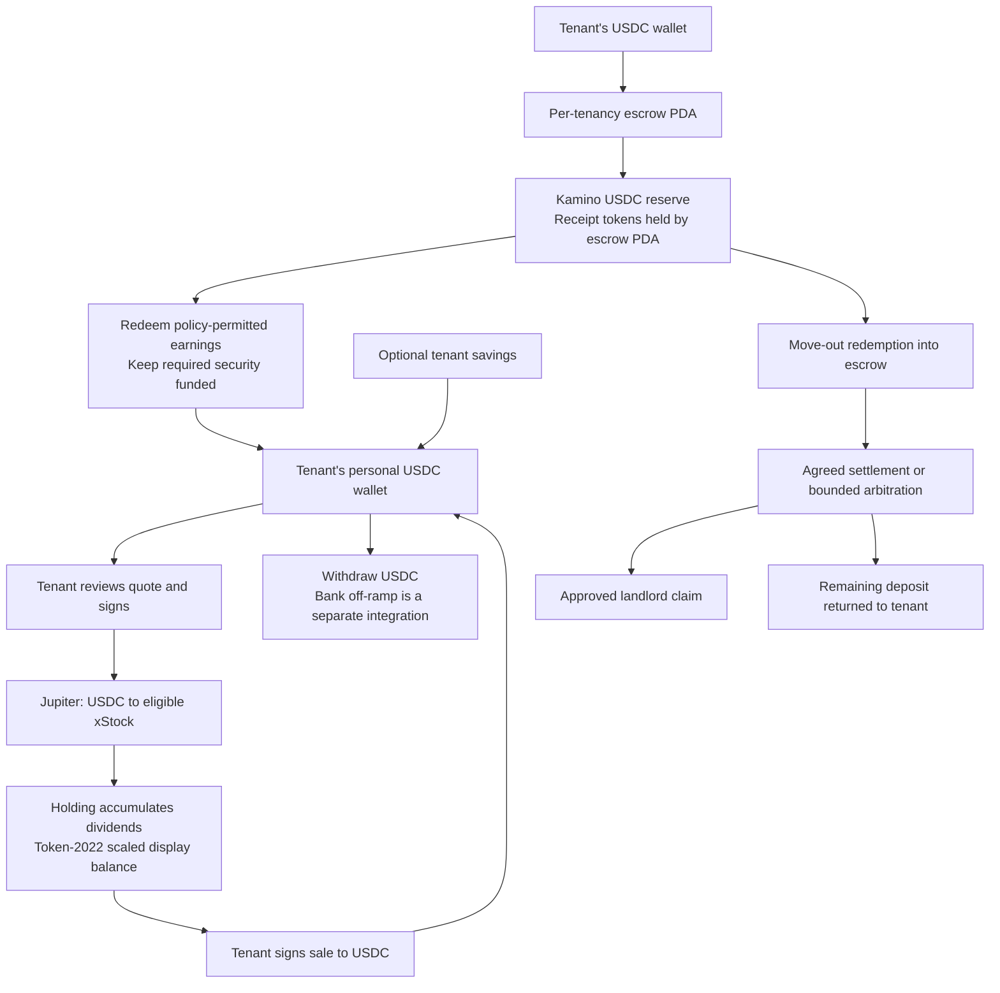

# Solana exploration: rental deposit to personal investments

Date: 22 September 2026. Status: parallel research track alongside Robinhood Chain. This document proposes components and first proofs; no program, wallet, lending position, or investment trade was created. Brand remains undecided.

The stack proposal is recorded in [ADR 0006](adr/0006-solana-usdc-kamino-and-xstocks.md), with [ADR 0003](adr/0003-enforce-custody-in-restricted-escrows.md) for custody, [ADR 0004](adr/0004-solana-embedded-wallet-and-separate-fee-sponsor.md) for wallets and [ADR 0007](adr/0007-reconcile-financial-operations-in-durable-steps.md) for financial operations. These remain proposals; this report retains the implementation detail and observed evidence. The [build spec](HACKATHON_BUILD_SPEC.md) defines the connected-demo acceptance criteria.

The shared product is **build assets while renting**: eligible deposit earnings contribute to a tenant's own investment portfolio, which survives moving home. The comparison scenario is a fictional USD-denominated 3,000-unit deposit, a policy-permitted earnings release, a $10 investment with $5/$25 economics checks, and a $120 approved claim at move-out. Those amounts are test inputs, not a return forecast.

Read with [the parallel coordination plan](./PARALLEL_STACK_EXPLORATION_2026-09-22.md) and the product plan. The original Gnosis workflow through Safe creation and Gnosis fork finance evidence remain valid for that implementation; they do not prove this Solana design.

## 1. Proposed stack and full flow

**Solana + native USDC + a restricted Anchor escrow + one Kamino lending reserve + a tenant-owned wallet + Jupiter + one eligible xStock.** SPYx is a concrete integration candidate, subject to the chosen customer profile and venue availability. It is not a recommendation to purchase that investment.



There is no bridge in this lifecycle. Each tenancy has one immutable chain/cluster and denomination. Robinhood and Solana compare the same product rules through independent finance adapters. Neither landlord nor arbitrator controls the personal portfolio, and stock holdings never count as rental security.

| Component              | Solana choice                                                                                                                                 | Reuse and new work                                                                                                             |
| ---------------------- | --------------------------------------------------------------------------------------------------------------------------------------------- | ------------------------------------------------------------------------------------------------------------------------------ |
| Product interface      | Existing Next.js, React, TypeScript and role workflows                                                                                        | Reuse concepts, documents and application shell; reconnect balances and actions to Solana evidence.                            |
| Server and storage     | Same-origin Next routes, Postgres ledger, private document storage                                                                            | Reuse infrastructure; add cluster-aware transaction and asset records.                                                         |
| Signing and onboarding | Privy passkey access with a user-owned embedded Solana wallet; sponsored fees through a separate fee payer, with Kora as the proposed service | Required connected-demo scope, including recovery. Native Solana signing replaces the Safe/Pimlico integration; see section 5. |
| Rental custody         | Rust/Anchor program with one tenancy PDA and restricted instructions                                                                          | New program and security tests. Reuse business rules, not Solidity bytecode.                                                   |
| Lending                | One explicitly selected Kamino USDC reserve; simple reserve liquidity supply/redemption                                                       | New Rust CPI adapter and TypeScript state decoder. No borrowing or managed allocation vault initially.                         |
| Personal investment    | Jupiter Swap API v2, issuer-verified xStock mint                                                                                              | New quote, signing, receipt and portfolio logic. Execute only from the tenant wallet.                                          |
| Corporate actions      | Token-2022 mint state plus issuer multiplier/corporate-action data                                                                            | New raw/scaled amount handling and historical snapshots.                                                                       |
| Reconciliation         | Solana RPC subscriptions plus durable polling/backfill                                                                                        | New signature, slot, commitment and account-delta reconciliation; shared operation IDs and domain states.                      |

Kamino documents REST data/transaction builders, `@kamino-finance/klend-sdk`, and a Rust `klend-interface` for CPI. Use public APIs for discovery and charts, SDK account decoding for reads, and narrow on-chain CPI calls for escrow authority. Its API transaction examples are ordinary wallet flows; blindly forwarding one is not a PDA custody implementation. [Kamino integration options](https://kamino.com/docs/build/developers/api-vs-sdk), [SDK source](https://github.com/Kamino-Finance/klend-sdk).

## 2. What was actually verified

Only public documentation, public APIs, and read-only RPC calls were used. No signer, API secret, financial account, or transaction submission was involved. These snapshots establish useful integration candidates, not production suitability.

### Token and program identity

| Item                     | Address and observation                                                                                                                                                          |
| ------------------------ | -------------------------------------------------------------------------------------------------------------------------------------------------------------------------------- |
| Native USDC, mainnet     | `EPjFWdd5AufqSSqeM2qN1xzybapC8G4wEGGkZwyTDt1v`; RPC confirmed 6 decimals, standard SPL Token owner.                                                                              |
| Circle test USDC, devnet | `4zMMC9srt5Ri5X14GAgXhaHii3GnPAEERYPJgZJDncDU`; RPC confirmed initialized, 6 decimals.                                                                                           |
| KLend                    | `KLend2g3cP87fffoy8q1mQqGKjrxjC8boSyAYavgmjD`; executable on mainnet at slot 449394579 and devnet at slot 502449436. Both program accounts use the upgradeable BPF loader.       |
| Candidate Kamino market  | `7u3HeHxYDLhnCoErrtycNokbQYbWGzLs6JSDqGAv5PfF`; current API calls it **SOL/BTC Market**. Some SDK examples call it Main.                                                         |
| Candidate USDC reserve   | `D6q6wuQSrifJKZYpR1M8R4YawnLDtDsMmWM1NbBmgJ59`; API maps it to native USDC. Both market and reserve accounts are owned by KLend, checked at mainnet slot 449394980.              |
| SPYx candidate, mainnet  | `XsoCS1TfEyfFhfvj8EtZ528L3CaKBDBRqRapnBbDF2W`; issuer API identifies SP500 xStock, ISIN `CH1436219716`. Mainnet RPC confirmed 8 decimals and Token-2022 owner at slot 449394698. |

The standard SPL Token program is `TokenkegQfeZyiNwAJbNbGKPFXCWuBvf9Ss623VQ5DA`; Token-2022 is `TokenzQdBNbLqP5VEhdkAS6EPFLC1PHnBqCXEpPxuEb`. These are different owners and must be explicit in token-account derivation and validation.

Sources: [Circle addresses](https://developers.circle.com/stablecoins/usdc-contract-addresses), [Kamino program deployments](https://kamino.com/docs/build/resources/program-addresses), [Kamino market API](https://api.kamino.finance/v2/kamino-market), [issuer SPYx metadata](https://api.xstocks.fi/api/v2/public/assets/SPYx), [issuer metadata schema](https://docs.xstocks.fi/apis/openapi/assets).

The candidate USDC reserve API returned approximately 124.93 million USDC supplied, 108.88 million borrowed, and supply APY `0.040445363521194766` (about 4.04%). This is an API snapshot, not guaranteed yield, a protocol risk review, or a verified immediately withdrawable amount. **Several reserves in the same market use the USDC mint:** select the reviewed reserve address, never the first symbol match. Reserve status, caps, oracle wiring, collateral exposure, available vault liquidity and queue configuration still need decoding before enabling supply. [Reserve metrics](https://api.kamino.finance/kamino-market/7u3HeHxYDLhnCoErrtycNokbQYbWGzLs6JSDqGAv5PfF/reserves/metrics).

### Indicative investment routes

Public `GET https://api.jup.ag/swap/v2/order` requests without a taker returned:

| Input                       | Quoted output in atomic units | Route observation                |
| --------------------------- | ----------------------------: | -------------------------------- |
| 5 USDC                      |     641,514 SPYx atomic units | Metis; Byreal, AlphaQ, Whirlpool |
| 10 USDC                     |   1,283,122 SPYx atomic units | Metis; Whirlpool                 |
| 25 USDC                     |   3,207,528 SPYx atomic units | Metis; Byreal, Whirlpool         |
| 1,283,122 SPYx atomic units |   9,984,927 USDC atomic units | JupiterZ reverse quote           |

All returned `feeBps: 10`, with USDC as the fee mint, and `transaction: null` because no taker was supplied. Quotes were sampled at different moments. They do **not** establish an executable round-trip cost, final token deltas, gas, account-creation rent, or future liquidity. The observed small-order routes justify the next proof instead of assuming micro-investing is impossible.

Jupiter's overview says API keys are required, although these public quote-only requests responded successfully. Plan a configured server-side API key and normal documented rate limits for the integration; keyless behavior is not a service guarantee. Use the current `/swap/v2` API rather than starting from old Ultra/Metis tutorials. [Current API](https://developers.jup.ag/docs/swap), [order semantics](https://developers.jup.ag/docs/swap/order-and-execute).

## 3. Rental program and accounting design

These are proposed application rules, not claims about an existing Solana implementation.

### Accounts and authority

- **Tenancy state PDA:** derive from a domain prefix, tenant public key and random lease identifier. Store version, bump, tenant, landlord, arbitrator, exact deposit mint, cluster-bound deployment, required security, release policy hash, state, counters and approved settlement amounts. Keep personal information and evidence off-chain; commit only a suitably salted reference/hash where necessary.
- **Escrow authority PDA:** either the tenancy PDA itself or a separate deterministic authority derived from it. It controls the tenancy's USDC account and the selected reserve's receipt-token account. These are token-program-owned accounts whose token authority is the PDA; the application state is owned by our program.
- **Kamino accounts:** pin KLend program, market, reserve, reserve liquidity supply, receipt mint and reserve/market authorities from validated state. Simple supply mints receipt tokens to our PDA account. Redemption burns them into our PDA's USDC account. No borrowing obligation is needed for the proposed simple receipt flow.
- **Claim/settlement state:** store an operation nonce and approved allocation. Tenant and landlord approve ordinary settlement; the assigned arbitrator can resolve only a registered disputed claim, within its amount and timing bounds, to the recorded parties. No arbitrary recipient or general execution instruction.
- **Personal portfolio:** the tenant wallet controls its own USDC and Token-2022 holdings. The rental program gets no signer or delegate over it. Landlord/arbitrator actions cannot sell investments or transfer them into escrow.

Program instructions are limited to initialization/acceptance, funding, supply, redeem-to-escrow, release eligible earnings, register/approve/resolve a claim, settlement and closure. A keeper may propose or trigger an already authorized deterministic action; it cannot choose the asset, reserve, recipient, or amount above the permitted cap. A program upgrade authority can change these rules, so record it explicitly and isolate it from ordinary operator keys; a test deployment is not an immutable custody claim.

Anchor provides seed, signer, owner, executable-program, mint and token-authority constraints. Validate accounts supplied through remaining-account lists too. Derive PDAs under the correct program and prohibit substituting another tenancy, market, token program, receipt mint or recipient. Check source/destination accounts again after CPI and use checked arithmetic. [Anchor account constraints](https://www.anchor-lang.com/docs/references/account-constraints).

### Supply and earnings release

Use Kamino's narrow reserve-liquidity deposit and reserve-collateral redemption operations. The Rust interface documents `helpers::deposit::deposit` returning refresh plus deposit instructions, and `helpers::withdraw::redeem` returning refresh plus redeem instructions. Its TypeScript examples mix simple lending and obligation-based flows; verify the pinned crate/IDL against deployed instructions rather than copying those examples interchangeably. [Deposit](https://kamino.com/docs/build/developers/borrow/operations/deposit), [redemption](https://kamino.com/docs/build/developers/borrow/operations/withdraw).

For each operation:

1. Refresh/validate the selected reserve and calculate its receipt-to-USDC exchange rate using protocol fixed-point arithmetic. Determine the required receipt units conservatively, including rounding.
2. Keep principal contributions, principal refunds/claims, released earnings, realized loss and unclassified transfers in separate ledgers. Recognized funding increases the principal basis; unsolicited USDC/receipt transfers do not automatically become earned interest.
3. Apply the shared release policy and cap the request by actual earned surplus, remaining security requirement, already committed releases, available liquidity and costs. Do not reserve an approved claim twice if it is already inside required security.
4. Redeem to escrow; inspect actual USDC received. Transfer only the permitted realized amount to the tenant. Assert the remaining conservative deposit value covers the active security requirement. On a shortfall, stale state, insufficient liquidity or failed assertion, the transaction fails and no personal cash is credited.

Amounts are unsigned atomic integers/checked fixed-point values, serialized as strings across APIs. The 3,000 USDC fixture is `3000000000` units. Rent/deposit denomination is an explicit USD/USDC test assumption; SOL is only transaction fees and account-storage funding. Track those fees separately, with a bounded sponsor budget if used. Do not quietly subtract them from the required deposit.

Kamino receipt yield appears in the exchange rate rather than a growing raw receipt balance. Borrower interest and farm incentives are different sources; exclude unclaimed KMNO and promotional rewards from releasable USDC. A supply-only depositor still bears lending/protocol risk. [Supply mechanics and liquidity](https://kamino.com/docs/products/borrow/supplying).

### Liquidity and settlement

Do not promise instant withdrawal. Read deposit/withdrawal flow caps as well as cash available. Kamino also documents optional withdrawal queues, market-specific flags, minimum ticket sizes and partial redemption. Its current queue guide says dedicated user queue helpers are not yet exposed in the public TypeScript SDK. First proof should support ordinary redemption with a clear liquidity-blocked state; add a PDA-owned ticket flow only if the selected reserve requires it. Queued claims replace burned receipts in the ledger and must never be counted as settled USDC. [Withdrawal caps](https://kamino.com/docs/curators/markets/withdrawal-caps), [withdrawal queue](https://kamino.com/docs/curators/markets/withdrawal-queue).

At move-out, redeem the remaining deposit position and settle the approved allocation. The shared $120 claim fixture pays `120000000` USDC units to the recorded landlord and returns the remaining eligible funds to the tenant. Keep settlement pending if redemption is incomplete. Any loss must be shown explicitly; personal investments cannot cover it automatically. Close token/storage accounts only after all shares, cash, tickets and claims are accounted for, and return storage lamports to their recorded payer.

## 4. Personal investing and dividend accumulation

xStocks provide economic exposure through tracker certificates; they do not convey ordinary shareholder voting rights. Their current FAQ excludes US offering/solicitation and distinguishes secondary-market trading from direct issuer issuance/redemption, which has onboarding and a $5,000 minimum. An accessible DEX quote does not establish a customer's eligibility or an app's distribution permission. Use a fictional eligible non-US profile for the demo and verify the real target profile before a pilot. [xStocks FAQ](https://docs.xstocks.fi/docs/frequently-asked-questions).

The mainnet SPYx mint had the following relevant extensions at the checked slot: Scaled UI Amount, a permanent delegate, pause authority (`paused: false`), default initialized account state, a confidential-transfer configuration, metadata and a transfer-hook configuration whose program ID was null. A null hook today does not promise it will stay disabled. Observe and validate current extensions, freeze/pause state and authorities before each supported action; do not treat this as an unrestricted legacy SPL token. Issuer powers are distinct from our application's permissions: keeping landlord/arbitrator authority out of the portfolio does not remove the issuer's token controls.

The active multiplier was `1.005714560286254`, matching the issuer multiplier API. The same SPYx address returned no account on devnet at slot 502449626. That establishes no same-address devnet deployment; it does not prove the issuer has no other test environment. [Issuer multiplier](https://api.xstocks.fi/api/v2/public/assets/SPYx/multiplier?network=Solana), [Token-2022 extension model](https://solana.com/docs/tokens/extensions).

Portfolio accounting must distinguish:

```text
raw units        = actual token-account amount, used in transactions
base token units = raw units / 10^mint_decimals
display exposure = base token units × effective multiplier
cash received    = actual settled USDC transfers, not multiplier growth
```

Dividends compound inside the holding; no app-generated cash dividend or second reinvestment occurs. Stock splits change units without creating investment profit. Keep contributions, realized sale proceeds, unrealized value and corporate-action adjustments separate. Store the effective multiplier and price denomination at each historical observation; do not rescale old trades using today's multiplier. [xStocks multiplier guide](https://docs.xstocks.fi/developers/multipliers).

Read current and scheduled multiplier state from the mint, using chain time for activation and supported conversion helpers. Round partial transfers down and use the complete raw balance for “sell all.” Never multiply an already scaled RPC `uiAmount` again. Oracle/market prices must specify whether they price raw token units or scaled exposure. Portfolio valuation should satisfy `raw units × raw-unit price = scaled exposure × scaled-exposure price`; reconcile the units before charting gains. A current executable sell quote is the cash-out estimate; an underlying stock price is only a marked valuation. [Solana scaled amounts](https://solana.com/docs/tokens/extensions/scaled-ui-amount), [integration rules](https://solana.com/docs/tokens/extensions/scaled-ui-amount/integration-guide).

The first purchase is explicitly signed by the tenant after reviewing input, minimum received, fees and quote expiry. Use Jupiter's `/order` and `/execute` for this separate wallet flow. Validate decoded instructions, resolved lookup tables, input/output mints, signers, recipients and amount limits before presenting a signature. Do not modify returned RFQ transactions. `/build` is the alternative for controlled custom composition; the rental escrow itself never calls a general swap route. [Jupiter routing paths](https://developers.jup.ag/docs/swap), [custom builds](https://developers.jup.ag/docs/swap/build).

Resolve an unknown submission by signature and account deltas before requesting another signature. A successful API response or received signature alone is insufficient. Record the confirmed/finalized transaction and actual net input/output; fees can be charged in the input or output asset. If a multiplier changes, trading pauses, a quote expires or no suitable route exists, keep the tenant's cash available and the order unfilled. Recurring purchases are a later feature requiring a scoped, revocable mandate.

## 5. Wallets, banking and server operation

**Passkey access, sponsored fees and recovery are requirements for the connected demo.** A connected external wallet may help isolate a protocol test, but it does not satisfy the consumer onboarding requirement. The following is the proposed implementation, supported by provider documentation; none of these wallet integrations has been implemented or exercised in this exploration.

| Capability from the EVM experience        | Proposed Solana implementation                                                                                                                                                                                                                                                                                                                                                                       |
| ----------------------------------------- | ---------------------------------------------------------------------------------------------------------------------------------------------------------------------------------------------------------------------------------------------------------------------------------------------------------------------------------------------------------------------------------------------------- |
| Passkey access without a wallet extension | Privy authentication plus a user-owned embedded Solana wallet. Privy supports passkeys and Solana signing; configure user authorization explicitly. [Authentication](https://docs.privy.io/authentication), [Solana signing](https://docs.privy.io/wallets/using-wallets/solana/sign-a-transaction), [ownership controls](https://docs.privy.io/security/wallet-infrastructure/policy-and-controls). |
| Pimlico-like fee sponsorship              | Solana has a separate transaction fee payer. Use an app-funded sponsor, with Kora as the proposed fee-abstraction service. The sponsor pays SOL while the tenant authorizes spending. Solana does not need an ERC-4337 bundler for this. [Solana fee abstraction](https://solana.com/docs/payments/send-payments/payment-processing/fee-abstraction).                                                |
| Safe-like multisig approvals              | Squads provides programmable multisig accounts. Use it where shared operator or program-upgrade authority is needed. Rental custody remains the restricted escrow program described above. [Squads development](https://docs.squads.so/main/development).                                                                                                                                            |
| Recovery on another device                | Enroll and verify a backup access method before funding. Privy can associate several authentication methods with the same user and wallet; the actual recovery configuration must pass a new-device test. [Authentication methods](https://docs.privy.io/authentication).                                                                                                                            |

Privy passkey login authorizes access to an embedded wallet that signs Solana transactions. This differs from a smart wallet that verifies the passkey's authority on-chain. **Swig is a concrete alternative for that second model:** its SDK documents WebAuthn/secp256r1 authorities. Evaluate it if on-chain passkey authorization is a requirement; its wallet invocation, recovery permissions and extra transaction overhead must work with our escrow and investment route before selecting it. Do not add both wallet models to the first demo. [Swig passkeys](https://build.onswig.com/examples/passkeys).

Keep the authorities separate:

- The tenant's personal wallet owns released cash and investments. Neither the landlord nor arbitrator receives a wallet recovery role, signing delegation or portfolio access. Application login alone does not approve a purchase or withdrawal.
- The per-tenancy escrow enforces release conditions, remaining security, fixed recipients and bounded dispute decisions. A generic tenant/landlord/arbitrator two-of-three multisig would allow its threshold to bypass those business rules. Squads is not a substitute for enforcing them.
- The fee sponsor has a limited operating balance and validates allowed transaction instructions and spending limits. Paying fees must not grant token authority. Include network/priority fees and required account-creation rent in the sponsorship budget; display trading costs separately. Select the fee payer before collecting signatures. For Jupiter, use a supported sponsored order or compatible build route; do not rewrite a signed RFQ transaction.

The wallet proof must demonstrate:

1. A new user enrolls a passkey and accesses a Solana wallet without installing an extension or handling a seed phrase.
2. A verified backup method restores the **same wallet address** on another browser/device, preserving access to an existing tenancy and portfolio. Test loss of browser storage as well as logout; passkey sync alone is not a complete recovery design.
3. With a zero-SOL user wallet, the declared test flow funds escrow, releases eligible earnings, buys/sells the selected test investment and withdraws personal cash. Every required account-creation payment has an identified payer. Record each environment and do not present fixtures as live issuer trades.
4. Cancellation, an expired transaction or an unavailable sponsor leaves an understandable recoverable state. Retrying never repeats a completed release or purchase.
5. The sponsor, app backend and landlord/arbitrator credentials cannot independently spend the tenant's portfolio. Any configured upgrade authority and wallet-provider dependency remain explicit in the trust model.
6. Recovery and transaction confirmation work on the selected mobile and desktop browsers using a stable authentication domain. Link application identity to a verified wallet; never replace an escrow payout address merely because someone logs into another wallet.

Use Next server routes for quote/API credentials and authenticated operation intents, with a durable reconciler outside individual HTTP request lifetimes. Store cluster/genesis identity, mint, integer amounts, operation ID, signature, slot, commitment and decoded token deltas. Enforce tenant/landlord/arbitrator permissions in the server and program. WebSocket subscriptions provide timely updates; periodic backfill and account reconciliation recover dropped events. External APIs are discovery/indexing aids, not the authority for custody or whether a payout completed.

Funding begins with native USDC from the tenant wallet. Bank transfer/on-ramp and bank withdrawal are optional modules with their own provider account, identity checks, supported country, beneficiary and settlement evidence. Do not label a pooled virtual account as a tenant-owned IBAN or claim Monerium's Gnosis route exists on Solana. EURC being available on Solana does not establish a euro lending/on-off-ramp flow for this project. [Circle supported assets](https://developers.circle.com/circle-mint/supported-chains-and-currencies), [Monerium supported tokens](https://docs.monerium.com/tokens/).

## 6. Environments and bounded first proofs

| Environment       | What can be claimed                                                                                                 | What must remain separate                                                                                                              |
| ----------------- | ------------------------------------------------------------------------------------------------------------------- | -------------------------------------------------------------------------------------------------------------------------------------- |
| Mainnet read-only | Issuer metadata, token extensions, program/account owners, reserve API metrics and indicative routes were observed. | No deposit, harvest, purchase, sale or money withdrawal has executed.                                                                  |
| Devnet            | KLend executable program and Circle test USDC exist. A 23 September read-only probe found reserve candidates with matching account identities; [third-party receipts](evidence/SOLANA_DEVNET_RECEIPTS_2026-09-23.json) show batch refresh and redemption for one candidate. | This escrow's refresh/supply/redemption was not executed; no issuer xStock market was verified. Mainnet accounts and routes cannot simply be reused here. |
| Local SVM tests   | Proposed deterministic escrow, CPI and accounting proofs with pinned program binaries/accounts.                     | A snapshot does not reproduce all live liquidity, oracle updates, RFQ signatures or issuer events.                                     |
| UI demo fixtures  | Can exercise the complete narrative and rare failure/corporate-action cases.                                        | Must identify simulated amounts/events; a locally minted stock token is not issuer-backed SPYx.                                        |

The first engineering slice should produce evidence before a broad frontend remake:

1. **Pin the deployment manifest.** Re-run the [read-only devnet probe](../scripts/probe-solana-devnet.mjs), then select a candidate only after proving its live refresh, small supply and redemption. Decode its authorities, supply accounts, receipt mint, oracles, caps, queues and program version. Reject wrong owners/cluster/mints in a table-driven test. The 23 September [account snapshot](evidence/SOLANA_DEVNET_RESERVES_2026-09-23.json) found 21 matching test-USDC reserves, 17 passing the app's account-state checks; it is not an executable reserve proof.
2. **Prove custody and redemption with the real CPI interface.** In a bounded local SVM harness, fund the 3,000-unit fixture, supply, accrue an explicitly controlled test change, redeem $10 of policy-permitted earnings and preserve required security. Record before/after balances and compute usage. Reject arbitrary CPI, substituted reserve, cross-tenancy account, duplicate release and withdrawal of principal.
3. **Prove the consumer wallet and one investment route.** Exercise the passkey, recovery and zero-user-SOL requirements in section 5. With configured API access and an authorized test/simulation environment, build and inspect a $10 USDC-to-SPYx order plus reverse sale; measure $5/$25 quotes with actual payer/account-creation costs. Current quote-only results are the starting evidence. A capped mainnet execution would need its own approved funded-wallet action, and is not part of this research authorization.
4. **Prove portfolio semantics and closeout.** Replay or fixture a multiplier change, then show the correct exposure, unchanged raw balance and no fabricated cash dividend. Run the $120 claim settlement and demonstrate the tenant portfolio remains accessible. Show one liquidity-blocked withdrawal and a stale/failed investment quote.

Use LiteSVM or Mollusk for fast program tests; pin realistic runtime/account fixtures and add transaction-level verification where needed. Mollusk does not enforce every transaction-envelope constraint, so account count, lookup tables, transaction size and compute budget also need realistic simulation. Clone/load only the necessary dependency state; do not assume an EVM-style full mainnet fork is available. No validators, containers, packages or test harnesses were installed/run during this research. [Anchor LiteSVM](https://www.anchor-lang.com/docs/testing/litesvm), [Anchor Mollusk](https://www.anchor-lang.com/docs/testing/mollusk).

**Advance Solana to full implementation when:** the escrow can own/redeem the lending receipt through validated CPI; the investment route can be built and reconciled with the chosen wallet; passkey access, recovery and sponsored transactions pass the declared wallet proof; small contributions have acceptable measured costs; and the environment/evidence boundaries are explicit. If a provider has no issuer sandbox, retain mainnet read/simulation evidence alongside a clearly labeled connected test narrative. Do not report that combination as a continuous live finance proof.

Solana therefore deserves an equal bounded exploration track. Its investment liquidity is already concrete enough to investigate, while its new custody program and test-environment composition are the main engineering uncertainties.
