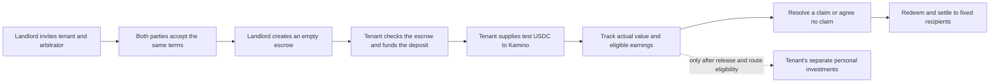

# A usable Solana tenancy journey

This is the **target customer journey and current connected proof**. The staged program is [deployed separately on devnet](evidence/SOLANA_STAGED_DEVNET_DEPLOYMENT_2026-09-24.json), with its finalized bytes and authority verified. A landlord using the recovered Privy wallet created an empty escrow for the separately accepted Exit proof apartment. The tenant later funded its 10 test USDC, supplied to Kamino and redeemed it. A zero-dollar landlord claim and tenant acceptance have finalized; the final payout is still pending. The existing funded Privy tenancy remains active on the pinned joint-signature program. [ADR 0009](adr/0009-stage-solana-escrow-setup-and-funding.md) records the custody boundary.

Each party has completed their actions at different times without staying online together. An unsigned operation can renew its short-lived blockhash for the same action, token movements and fee ceiling; a changed review stops before signing. A signed transaction retains its exact bytes for reconciliation. The present UI still exposes too much technical state and requires manual result checks; the target experience should show only a clear pending/completed step, with raw proof behind a disclosure.

## What each person sees

| Person | Main action | Completion evidence |
| --- | --- | --- |
| Landlord | Create the agreement, invite the others, accept terms, then **Create deposit space** | Finalized empty escrow matching the accepted terms; its security balance is zero. |
| Tenant | Join and accept, then **Deposit 10 test USDC** when ready | Finalized exact token debit/credit and escrow state `active`. A separate **Put deposit to work** action supplies to Kamino. |
| Arbitrator | Join as the assigned independent party; act only on a disputed claim | Role binding, recorded decision and a separately finalized settlement. No access to the tenant's personal wallet. |

The app should open the correct agreement from its invitation or saved account membership. It should show one next action for the current role, with amounts, destination and what the wallet signature permits. Receipt IDs, account addresses and raw transaction details belong in an expandable **Technical proof** section. The recovery check is a one-time prerequisite for using an original wallet, not a repeated step of every tenancy transaction.

## Boundaries that must stay visible

- **Accepted** means the two parties agreed to the recorded terms. No deposit has moved.
- **Deposit space ready** means the landlord's setup finalized, with zero security. It must never be labeled funded or active.
- **Funded** means the tenant's exact deposit transfer and resulting escrow state finalized. The tenant must compare the on-chain program, cluster, parties, mint, security amount, policy hash and fixed payout accounts before signing.
- **Earning** is shown only from observed reserve value. A positive annual percentage or fictional time travel is not a withdrawable balance. Release needs actual excess value, permission and liquidity.
- **Personal investments** use released personal cash, never principal. A price quote is not a purchase; the buy/sell path remains a separate proof gate.

## Failure cases for the next implementation

1. The tenant accepts on Monday and funds on Friday: the landlord can create the empty escrow in between, and no signature has to be repeated merely because the other person was offline.
2. A setup or funding review expires **before** wallet approval: only that actor refreshes the same intended action. If a signed broadcast has an unknown result, the app checks its original signature and on-chain state before allowing another intent.
3. A prepared escrow has different terms, a different program, or the wrong payout account: funding is blocked. A malicious or mistaken creation may occupy the agreement's PDA; the operator must resolve that conflict with a newly reviewed agreement rather than quietly changing terms.
4. The tenant never funds: the application continues to show zero security and cannot claim that the landlord is protected.
5. A wallet or browser disconnects: the user can reopen the tenancy from account membership and see the last confirmed step, without pasting an ID or redoing a completed signature.

## Build and proof order

1. Add a distinct, versioned staged-initialization instruction and deployment manifest. Keep the deployed joint-signature program and funded tenancy untouched.
2. Test that only the landlord can create the empty escrow, only the tenant can fund the exact principal, and neither party can change accepted terms or fixed recipients. Prove the full native cycle again on a local SVM.
3. Make the connected app's setup service select staged behavior **only** for a separately verified program hash and explicit manifest mode. Exercise interrupted, delayed and mismatched-agreement cases through signed service tests.
4. Replace the setup panel with role-specific next actions and a compact progress view. Rehearse with two accounts asynchronously and complete the separate exit-proof tenancy before asking the user for another coordinated browser session.
5. The new devnet program address, binary hash and authority are pinned, and the separate landlord-created empty escrow finalized. Fund it only after the tenant reviews the matching terms. Only after the end-to-end receipt proof should the staged flow be described as working.

The staged Privy tenancy now proves custody through redemption and zero-claim acceptance, but final payout and personal buy/sell remain unproved. No organic yield accrued during this test. A production deposit product needs separate provider, security, operations and legal review.
